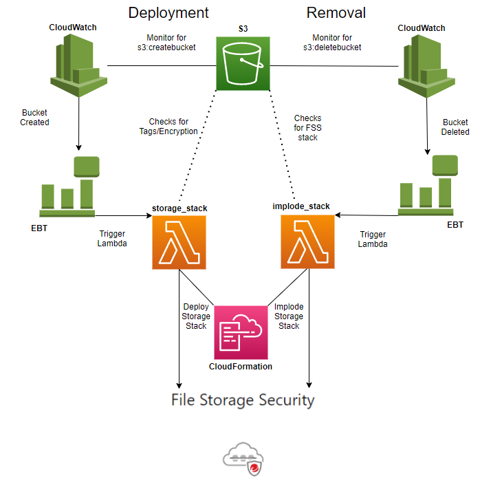

# Automation using Lambda to Deploy FSS- Storage Stack 

Automated process to deploy an FSS storage stack on each new S3 bucket using Lambda. The storage stack will be linked to the scanner stack previously defined. When the S3 bucket is deleted, the associated FSS Storage stack will be removed.

# Deploy via CloudFormation

   * If not already present, [deploy a Scanner Stack](https://cloudone.trendmicro.com/docs/file-storage-security/stack-add/#AddScanner) in the Cloud One - File Storage Security account.
   * Obtain the Scanner Stack Name and SQS URL
      - Go to AWS Console > Services > CloudFormation
      - Click **Name of Scanner Stack**
         - Copy **Stack Name** 
      - Under **Outputs** tab
         - Copy **ScannerQueueURL**
   * Go to AWS Console > Services > CloudFormation
    - Click **Create New Stack**
      - Prerequisites: `template is ready`
      - Specify Template: `upload from file`
      - Select: **[storage_stack_lifecycle.yaml](https://github.com/trendmicro/cloudone-filestorage-plugins/blob/master/deployment/aws-python-storage-stack-automation/storage_stack_lifecycle.yaml)**
      - Click **Next**
      - StackName: `Enter name for stack`
      - C1API: [Cloud One API Key](https://cloudone.trendmicro.com/docs/account-and-user-management/c1-api-key/)
      - C1RegionEndpoint: [Cloud One Regions](https://cloudone.trendmicro.com/docs/account-and-user-management/c1-regions/)
      - SQSURL: `http://scanner-stack-sqs-queue-url.com`
      - StackName: `Enter name of Scanner Stack`
      - Click **Create Stack**
      
# Additional Information
The Lambda will choose whether or not to deploy a storage stack depending on a bucket's tags. **See below for details**:

| Tag            | Value  | Behavior                       |
| -------------- | ------ | ------------------------------ |
| [no tag]       | [none] | Storage Stack deployed         |
| `FSSMonitored` | `yes`  | Storage Stack deployed         |
| `FSSMonitored` | `no`   | Storage Stack **NOT** deployed |

The script will add the proper tags automatically to untagged buckets, but you can *exclude* buckets by adding a `FSSMonitored` == `no` tag. 

**You can halt the mechanism by `disabling the eventbridge rule`**

**FSS protection will only be deployed to S3 buckets in same region that the template is created in**