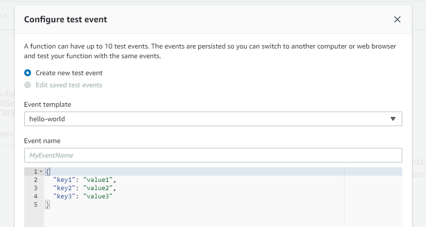

# Cloud One File Storage Security Scan Trigger - Full Scan and Scheduled Scan

It deploys all the required resources to trigger a full scan, scheduled or not, on a S3 bucket leveraging an existing Trend Micro File Storage Security deployment.

## Prerequisites

1. **Deploy File Storage Security**
    - Deploy FSS to desired bucket *before* deploying this stack.
2. **Find the 'ScannerQueueArn' SQS queue ARN**
    - In the AWS console, go to **Services** > **Amazon SQS ** > your ScannerQueue queue > **Outputs**.
    - locate **ScannerQueueArn** ARN.
    - Copy the **ScanResultTopic** ARN to a temporary location. Example: `arn:aws:sqs:us-east-1:123456789012:All-in-one-TM-FileStorageSecurity-ScannerStack-IT1V5O-ScannerQueue-1IOQHTGGGZYFL`
3. **Find the 'ScannerQueueUrl' SQS queue url**
    - In the AWS console, go to **Services** > **CloudFormation** > your all-in-one stack > **Outputs**  or **Services** > **CloudFormation** > your storage stack > **Outputs**.
    - Scroll down to locate the  **ScannerQueueURL** Key.
    - Copy the **ScannerQueueURL** URL to a temporary location. Example: `https://sqs.us-east-1.amazonaws.com/123456789012/All-in-one-TM-FileStorageSecurity-ScannerStack-IT1V5O-ScannerQueue-1IOQHTGGGZYFL`
4. **Find the 'ScanResultTopicARN' SNS topic ARN**
    - In the AWS console, go to **Services** > **CloudFormation** > your all-in-one stack > **Outputs**  or **Services** > **CloudFormation** > your storage stack > **Outputs**.
    - Scroll down to locate the  **ScanResultTopicARN** Key.
    - Copy the **ScanResultTopic** ARN to a temporary location. Example: `arn:aws:sns:us-east-1:123456789012:All-in-one-TM-FileStorageSecurity-StorageStack-1E00QCLBZW7M4-ScanResultTopic-1W7RZ7PBZZUJO`

## Installation

### From CloudFormation

1. Download cloudone-filestorage-plugin-full-scan.json
2. Visit [CloudFormation's Creat stack page](https://console.aws.amazon.com/cloudformation/home?region=us-east-1#/stacks/create/template)
3. Select `Upload a template file` and pick the downloaded template
4. Fill in the parameters.
5. Check the `I acknowledge that this app creates custom IAM roles.` checkbox.
6. Click `Deploy`.

### From AWS Lambda Console

1. Visit [the app's page on the AWS Lambda Console](https://console.aws.amazon.com/lambda/home?#/create/app?applicationId=arn:aws:serverlessrepo:us-east-1:415485722356:applications/cloudone-filestorage-plugin-trigger-full-scheduled-scan).
2. Fill in the parameters.
3. Check the `I acknowledge that this app creates custom IAM roles.` checkbox.
4. Click `Deploy`.

### Embed as a Nested App in Your Serverless Application

1. Visit [the app's page on the AWS Lambda Console](https://console.aws.amazon.com/lambda/home?#/create/app?applicationId=arn:aws:serverlessrepo:us-east-1:218213273676:applications/cloudone-filestorage-plugin-trigger-full-scheduled-scan).
2. Click the `Copy as SAM Resource` button and paste the copied YAML into your SAM template, filling in any required parameters.

## Running it

After deployment, trigger the new Lambda function `BucketFullScan` with any payload, empty or otherwise, using whatever method you feel most comfortable with. The scan will be queued right after that.

### Running via GUI

Open the Lambda function `BucketFullScan` in Lambda's dashboard. Click in "Test"  an then in "New Test". You should see a window like the one below:

Leave it as it, add any event name, such as "Full Scan" and press save. Click in "Test" again and wait for execution. All files should be queued for scan now.

### Running via CLI

`aws lambda invoke --function-name BucketFullScan output | cat output`
